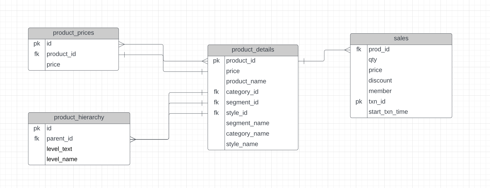

# Case 09: Clothing Retail Insights

## Table of Contents
- [Case 09: Clothing Retail Insights](#case-09-clothing-retail-insights)
  - [Table of Contents](#table-of-contents)
  - [Problem Statement](#problem-statement)
  - [Dataset Description](#dataset-description)
  - [Questions](#questions)
  - [Solutions](#solutions)
  - [Objective](#objective)
  - [Entity Relationship Diagram](#entity-relationship-diagram)

## Problem Statement
QT Clothing Company, a trendy fashion retailer, aims to optimize its merchandising strategy by analyzing sales performance. The goal is to generate a financial report that provides insights into product sales, customer behavior, and revenue distribution across categories and segments to support data-driven decisions.

## Dataset Description
The dataset is provided in [`data.sql`](dataset/data.sql) under the schema `dt`. It includes four tables:
- **product_hierarchy**: Defines the product hierarchy (Category → Segment → Style).
  - Columns: `id`, `parent_id`, `level_text`, `level_name`
- **product_prices**: Stores product prices.
  - Columns: `id`, `product_id`, `price`
- **product_details**: Contains detailed product information (e.g., name, category, segment, style).
  - Columns: `product_id`, `price`, `product_name`, `category_id`, `segment_id`, `style_id`, `category_name`, `segment_name`, `style_name`
- **sales**: Records transaction details.
  - Columns: `prod_id`, `qty`, `price`, `discount`, `member`, `txn_id`, `start_txn_time`

## Questions
A comprehensive list of analysis questions is available in [questions.md](questions.md), covering high-level sales analysis, transaction analysis, and product performance.

## Solutions
SQL queries addressing the questions are provided in [solutions.sql](solutions.sql).

## Objective
This case study is designed to practice SQL skills, including joins, aggregations, window functions, and percentile calculations, while deriving actionable insights for retail merchandising and financial reporting.

## Entity Relationship Diagram
